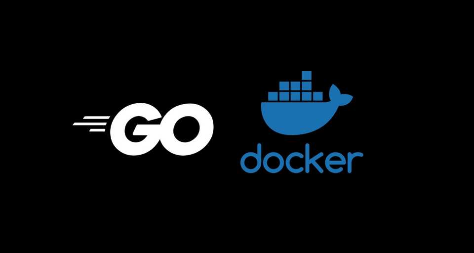

# simplebank
Practice golang+postgresql+docker+gin by simplebank project

## Simple bank service

The service that is a simple bank, which is going to build by golang. It will provide APIs for the frontend to do something following things:

1. Create and manage bank accounts, which are composed of owner’s name, balance, and currency.
2. Record all the balance changes from each other of the account. In order to record the transaction of transfer the account, also an account entry record will be created.
3. Between two accounts, perform a money transfer. What should happen within a transaction, so that the both accounts’ balance are updated successfully.

## development tools

### should install tools

- [docker](https://www.docker.com/products/docker-desktop)
- [tablepuls](https://tableplus.com/)
- [postgresql images](hub.docker.com/_/postgres)  
`docker pull pstgres:12-alpine`
- [migrate](https://github.com/golang-migrate/migrate/tree/master/cmd/migrate)  
`brew install golang-migrate`
- [sqlc](https://github.com/kyleconroy/sqlc#installation)  
`brew install sqlc`

## Generate code

- Generate SQL with CRUD by sqlc:  
`make sqlc`

## Build and Run

- run test  
`make test`

- run server with cmd by config variables

`SERVER_ADDRESS=0.0.0.0:8081 make server`

## github ci action

- db connection refused

search "golang action postgres"

## Continuously updated......

......
